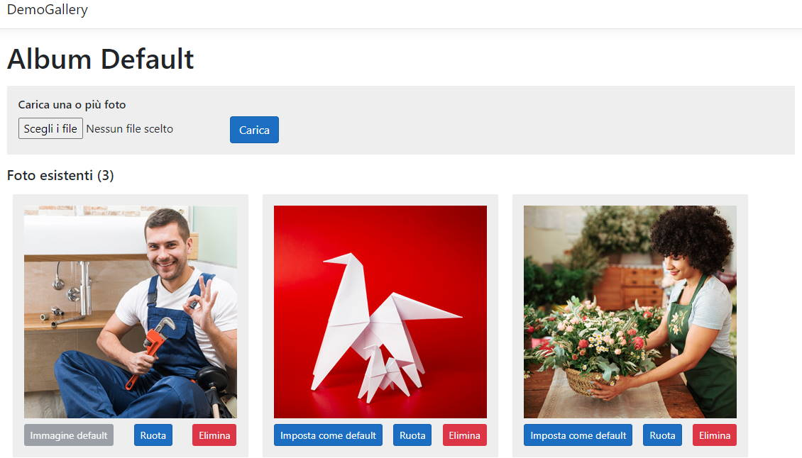

# DEMO Gallery fotografica
Applicazione ASP.NET Core 3.1 che permette il caricamento di una o più immagini in un album fotografico.
 * Le immagini sono ridimensionate a massimo 300x300 pixel usando [Magick.NET](https://www.nuget.org/packages/Magick.NET-Q8-AnyCPU/);
 * Impostazione di un'immagine predefinita;
 * Rotazione delle immagini.

L'applicazione non richiede database ma si basa unicamente sul contenuto della directory `wwwroot/albums`.

La demo può essere estersa per supportate la creazione di vari album.

